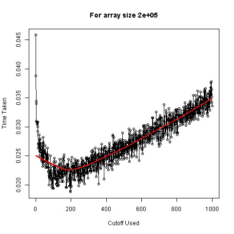
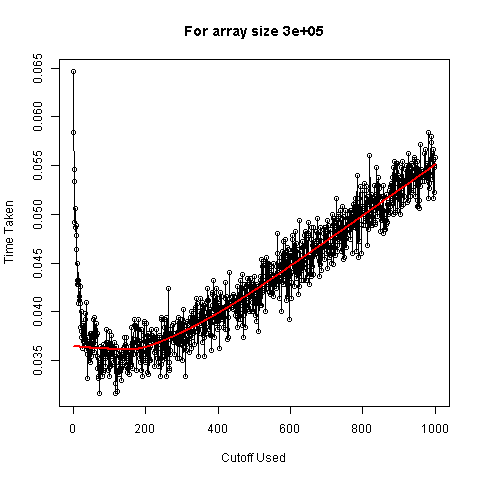
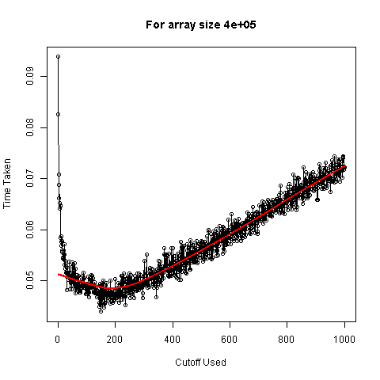
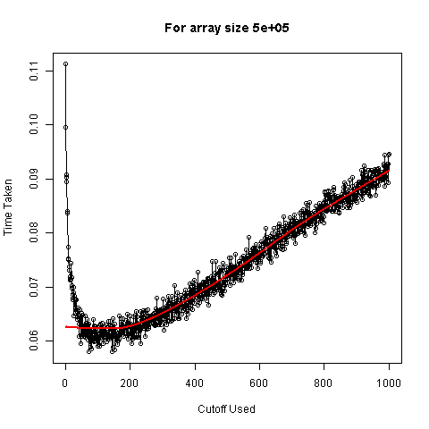
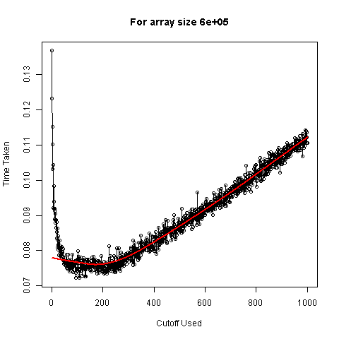
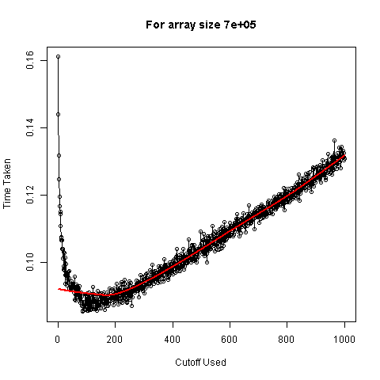
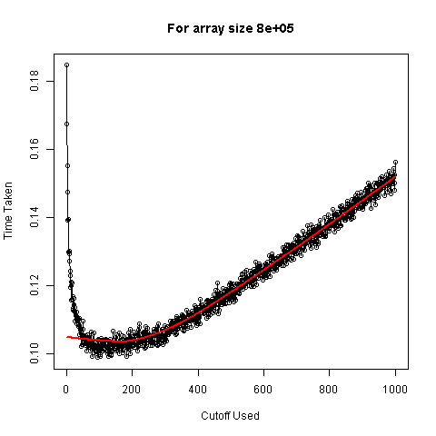
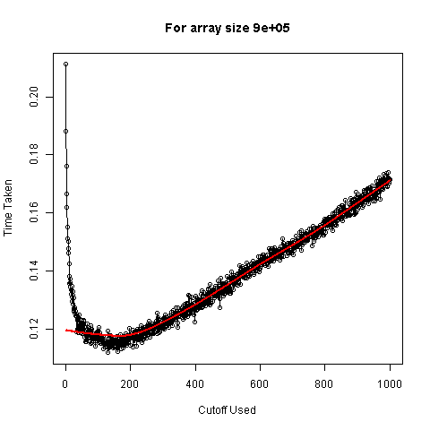
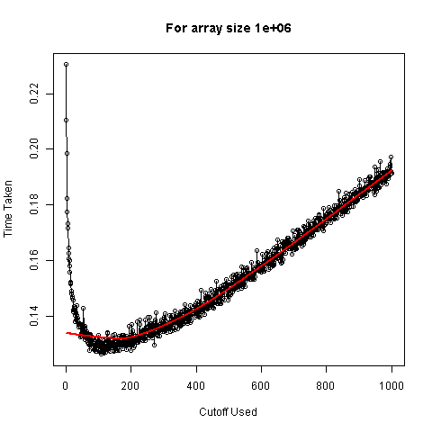
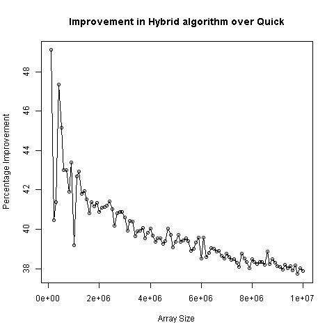

# Hybrid Quick Sort + Insertion Sort: Runtime Comparison
## Anirban Ray

## Objective
Among numerous sorting algorithms, some of the common algorithms are **Quick Sort** and **Insertion Sort**. Quick sort is very popular since it is the fastest known general sorting algorithm in practice which provides best run-time in average cases. Insertion sort, on the other hand, works very well when the array is partially sorted and also when the array size is not too large. In this project, we will try to combine these two algorithms in such a way that we can use both the speed of quick sort and also the benefit of effectiveness of insertion sort. Afterwards, we would like to find hybrid algorithm (combination of insertion and quick), which is optimum in the sense of minimum average run-time.

## Insertion Sort
Insertion sort is an iterative sorting algorithm. The main idea of this is that at each iteration, insertion sort removes an element, find its ordered position in the sorted array of the previous elements and inserts it there. The algorithm can be written as below:

### Algorithm
```
INSERTIONSORT(A)
for j = 2 to A.length
    key = A[j]
    i = j - 1
    while i > 0 and A[i] > key
        A[i + 1] = A[i]
        i = i - 1
    A[i + 1] = key
```

## Quick Sort
Quick sort is a divide and conquer algorithm. It first divides a large array into two sub-arrays with respect to a pivot element, where all elements of one sub-array is not more than the pivot element, and those of the other are not less than that. Then it does the same for the two sub-arrays and continue to do so until a stage is reached where all sub-arrays are of size 1. Since all these sub-arrays are now sorted trivially, merging these will result in completion of the sorting process. The algorithm to sort the $p^{th}$ to $r^{th}$ of the array A is as follows.

### Algorithm
```
QUICKSORT(A, p, r)
if p < r
    q = PARTITION(A, p, r)
    QUICKSORT(A, p, q)
    QUICKSORT(A, q + 1, r)

PARTITION(A, p, r)
x = A[p]
i = p - 1
j = r + 1
while TRUE
    repeat
        j = j - 1
    until A[j] <= x
    repeat
        i = i + 1
    until A[i] >= x
    if (i < j) exchange A[i] with A[j]
    else return j
```

### Choice of Pivot
Different choices of the pivot element are available for different types of the input array. In the above-mentioned algorithm, we have used the first element of the array. Lomuto used the last element of the array. Sometimes a random index is chosen and swapped with the last element and then the Lomuto partitioning method is followed. Singleton used the median of three method, where one first sort the first, last and middle-most elements of the array, and then exchange the middle most element of the modified array with the first element of the array and proceed as before. In this project, we will always use random inputs, in which case the choice of pivot does not matter too much. So, we will continue to use the first element as pivot following Hoare, the first proposer of the quick sort algorithm.

## Hybrid Sort
Now we come to the formulation of the new hybrid algorithm. Since we know that insertion sort works better for arrays with partially sorted sub-arrays of small size, we start the sorting procedure by the partition approach of quick sort algorithm. But instead of continuing until we reach sub-arrays of one element each, we stop partitioning when we reach the stage of sub-arrays of size less than some given cut-off size, which distinguishes between the small and large arrays. After this step gets completed, we have an array constituting of sub-arrays of sizes less than or equal to the cut-off size, which are not sorted themselves, but as a whole, they are sorted. Finally, we run insertion sort over the entire array to get the completely sorted output. The algorithm is the following.

### Algorithm
```
HYBRIDSORT(A, p, r, k)
if (p < r)
    if (r - p + 1 > k)
        q = PARTITION(A, p, r)
        HYBRIDSORT(A, p, q, k)
        HYBRIDSORT(A, q + 1, r, k)

INSERTIONSORT(A)
```

## Implementation of the Sorting Algorithms and Finding the Optimum Cutoff Size
We first define the sorting algorithms using the _Rcpp_ package.

[C++ Code](./Rcpp Code.cpp)

## Results
Now that we have defined our sorting algorithms, in the next step, we wish to find the optimum choice for the cut-off by simulation study, since it is not known and the concept of "small" is pretty vague. We should mention now that we have performed separate simulation studies to compare among different implementations of quick sort, and noted that the one by Hoare is the fastest, at least for random array. We will not include the codes or results of this simulation study in our project, but we will use only Hoare implementation for both quick sort and hybrid sort. Therefore, we define functions in _R_ (by calling the C++ functions) to compute the average run-time of our hybrid algorithm for given choice of the cut-off array size. We run these functions over different choices of cut-off sizes for different array sizes. Then, we apply lowess for each array size to find the interval resulting in higher efficiency in terms of runtime. Finally, we proceed to plot the average run-times against choices of cut-offs for different array sizes for simplify the visualisation.

### Graphs




















#### Observations from the Graphs
+ Firstly, we see that there is a sharp fall in all the graphs initially. This proves the effectiveness of the hybrid algorithm over quick sort, as it should be noted that for the choice of cut-off as 1, we are essentially applying quick sort over the entire array. So that steep fall helps us to conclude with confidence that combining the two algorithms is not at all worthless. This is because of the fact that as quick sort is a recursive algorithm, it has a too much of overhead cost for calling itself repeatedly for small arrays.

+ Secondly, we note that after a certain point, average run-time has a steadily increasing trend, which is due to the fact that insertion sort is effective only for "small" arrays. As we are increasing the cut-off size, insertion sort needs to be applied on larger partially sorted sub-arrays and hence the sorting of the entire array becomes slower.

+ Finally, we observe that the trade-off between these two opposite effects on run-time is balanced in the lower part of the skewed U-shaped pattern, which is revealed in all the graphs, in more or less extent.

Based on our interpretation of the graphs, most of the optimum cut-offs as obtained from lowess are in between 160 to 175, which can be verified from the table below. Thus based on the results of the simulation stufy, we subjectively choose **170** as cut-off in the latter sections, without any analytical justification.

| Array Sizes | Optimum Cutoffs |
|:-----------:|:---------------:|
|    1e+05    |       172       |
|    2e+05    |       190       |
|    3e+05    |       163       |
|    4e+05    |       181       |
|    5e+05    |       136       |
|    6e+05    |       172       |
|    7e+05    |       172       |
|    8e+05    |       163       |
|    9e+05    |       163       |
|    1e+06    |       163       |

Table: **Lowess Results**

## Improvement over Quick Sort
Now, a plausible (and of course perfectly reasonable) question will be how much do we gain from this algorithm or do we gain at all. We have already shown in the previous section that the run-time is significantly improved for hybrid method over quick sort. Now, we wish to see whether this improvement varies with the size of the input array or not. For that purpose, we define a function to calculate the percentage improvement in run-time in hybrid sort over quick sort and plot the results. We now plot these to get an idea of the improvement pattern.



### Explanation of Improvement Pattern
From the graph, it is evident that hybrid sort always outperforms quick sort comfortably for all the array sizes. But the same graph also reveals that the improvement is decreasing as array size increases. But one should note that the percentage improvement is more than 35% (which is, of course, very significant for practical purposes). The unexpected decreasing trend can be explained by the slow nature of insertion sort algorithm. In hybrid sort, we are using insertion sort over the entire array in the last step. Although, at this step, the array is partially sorted, it should be kept in mind the insertion sort is significantly effective only for small arrays. We use insertion sort to minimise the large overhead cost due to recursive calls of the quick sort for small arrays, but this remedy comes with its own cost that for large arrays, it is intrinsically slow, however partially sorted the array may be. Thus, as array size increases, the run-time for this step also increases.

## Summary
At the end the project, we see that we have successfully improved the quick sort by combining insertion sort with it. We have also provided an interval where the optimum choice of cut-off size should lie. We have also verified the consistent out-performance of hybrid sort over quick sort. Thus, we can use this algorithm as an alternative for the quick sort algorithm.

## References
1. [Introduction to Algorithms - Third Edition](https://mitpress.mit.edu/books/introduction-algorithms)
2. [Wikipedia - Quick Sort](https://en.wikipedia.org/wiki/Quicksort)
3. [Wikipedia - Insertion Sort](https://en.wikipedia.org/wiki/Insertion_sort)
4. [Techie Delight - Hybrid QuickSort Algorithm](www.techiedelight.com/hybrid-quicksort)
